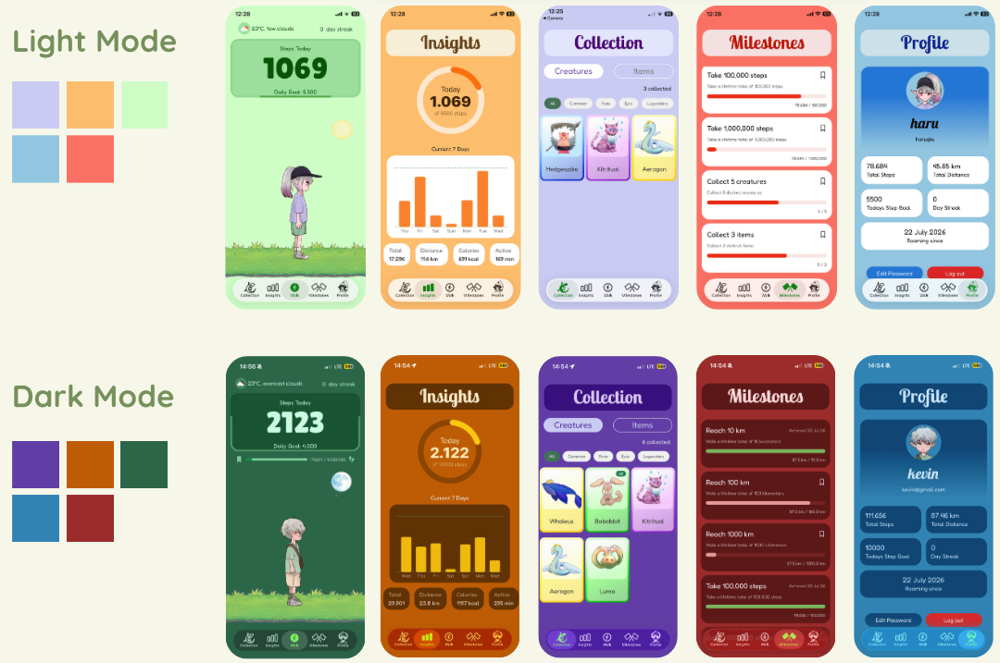

<div align="center">

# 🐾 RoamPals

**Walk in the real world, collect creatures in a small one.**

A gamified step tracker for iOS and Android: steps are detected on-device from raw accelerometer
data, and crossing a step threshold spawns a creature or item you can keep.

<p>
  
  
  
  
  
  
  
</p>



</div>

---

## Overview

Most step trackers hand you a number. RoamPals turns the number into a reason to keep walking:
every user gets a personal schedule of step thresholds, and crossing one makes a creature or an
item appear — keep it, and it lands in your collection.

Two things make it more than a counter with sprites on top:

**Steps are computed, not requested.** There is no HealthKit or Google Fit dependency for live
counting. `useAccelerometerSteps` samples the raw accelerometer at 50 Hz and runs its own gravity
filter, projection and peak detection, so the exact same step logic runs on both platforms. The
system pedometer is used for one narrow job only: filling the gap while the app was closed.

**Spawns are per-user rows, not a global rule.** At registration the backend materialises the whole
spawn schedule as `CreatureSpawnCondition` / `ItemSpawnCondition` rows owned by that user. When a
threshold fires, that row is deleted — so a spawn can never trigger twice, and progress survives
without any extra "already claimed" bookkeeping.

---

## Features

| | Feature | Detail |
|---|---|---|
| 👟 | **Custom step detection** | 50 Hz accelerometer sampling, low-pass gravity baseline, dot-product projection onto the gravity axis, threshold + cooldown peak detection |
| 🕒 | **Catch-up while closed** | On resume, `Pedometer.getStepCountAsync` fills the window since `last_closed_timestamp`, splitting the range at midnight so yesterday's steps land on yesterday's date |
| 🐉 | **Creature & item spawns** | Per-user step thresholds seeded at registration; the client detects the crossed interval and pulls the creature/item details on the spot |
| 🎒 | **Collection** | Creatures and items in separate tabs, filterable by rarity, each card driven by a looping sprite sheet |
| 📊 | **Insights** | Goal ring, 7-day bars and a scrubbable 30-day trend area chart — all hand-built with `d3-scale`/`d3-shape` + `react-native-svg`, no charting library |
| 🏁 | **Milestones** | Step, distance, creature and item goals evaluated server-side; pin one and its progress bar follows you onto the Walk screen |
| 🔥 | **Streaks** | Recomputed on every save by walking backwards day by day while the daily goal was met |
| 🔐 | **JWT auth** | Spring Security + jjwt, BCrypt hashes, token in `expo-secure-store`, attached by an axios interceptor and expiry-checked on launch |
| 🌤️ | **Weather badge** | Current conditions from OpenWeather for the device location via `expo-location` |
| 🎨 | **Per-screen theming** | Every tab has its own light and dark palette, resolved through `useThemeColor` |
| 📥 | **Health import** | `POST /api/daily-activity/import` accepts a batch of days, so historical Apple Health data can be pushed in from a Shortcut |

---

## Architecture

```
┌──────────────────────────────────────────────┐
│  Expo app (React Native · expo-router)       │
│                                              │
│  screens ──► zustand stores ──► api/*.ts     │
│     ▲             ▲                 │        │
│  hooks (accelerometer, weather, insights)    │
└─────────────────────────────────────┼────────┘
                                      │ axios + Bearer JWT
                                      ▼
┌──────────────────────────────────────────────┐
│  Spring Boot API (:8090)                     │
│                                              │
│  JwtAuthFilter ──► SecurityFilterChain       │
│        │                                     │
│        ▼                                     │
│  @RestController ──► @Service ──► @Repository│
└─────────────────────────────────────┼────────┘
                                      │ Spring Data JPA
                                      ▼
                          ┌───────────────────────┐
                          │ PostgreSQL (:5439)    │
                          │ seeded via import.sql │
                          └───────────────────────┘
```

**Mobile app.** File-based routing under `src/app`. `_layout.tsx` loads fonts, then `Stack.Protected`
guards pick the route group from auth state: logged out → login/register, logged in without an avatar
→ onboarding, otherwise the five native tabs. Two Zustand stores hold the shared state — `useUserStore`
for the profile, `useStepsStore` for live steps, virtual steps and the spawn schedule. Everything that
talks to the API goes through `src/api/client.ts`, a single axios instance with the JWT interceptor.

**Backend.** A conventional controller → service → repository split. Controllers stay thin and read the
caller from the `Principal` / `SecurityContextHolder` rather than trusting an id in the request, services
own the rules (spawn triggering, streaks, milestone progress), repositories are Spring Data interfaces.
Hibernate creates the schema (`ddl-auto=update`) and `import.sql` seeds creatures, items and milestones
idempotently with `ON CONFLICT DO NOTHING`.

---

## How it works

### Step detection

`frontend/src/hooks/use-accelerometer-steps.ts` is the core of the app. Each 20 ms sample goes through:

1. **Gravity baseline** — a low-pass filter (`ALPHA = 0.98`) tracks the slow-moving gravity vector, so
   the algorithm keeps working when the phone changes orientation mid-walk.
2. **Linear acceleration** — the baseline is subtracted from the raw reading, leaving only kinetic motion.
3. **Projection** — the gravity vector is normalised to a unit vector and the linear acceleration is
   projected onto it with a dot product. That single scalar is the vertical force of a footfall, which is
   why the detector doesn't care whether the phone sits in a pocket, a hand or a bag.
4. **Peak detection** — a `0.4` magnitude threshold separates strides from jitter.
5. **Cooldown** — 450 ms between counted steps, comfortably above the ~300 ms floor of a human stride, so
   one impact can't be counted twice.
6. **Warm-up** — the first 500 ms after start are discarded while the gravity baseline converges.

Counters live in refs (no re-render per sample) and are mirrored into `AsyncStorage` on every change.
That matters because the steps POST overwrites the day's value absolutely: without rehydration, an app
kill would reset the buffer to 0 and clobber the higher count already stored on the server.

### Spawning

The client holds the user's remaining thresholds in `useStepsStore.spawnConditions` and, on every step
change, looks for a condition inside the interval `(previousSteps, currentSteps]` — an interval test
rather than an equality test, so a burst of steps between renders can't skip a spawn. The matching
creature or item is then fetched by id and shown in a pop-up; saving it writes a `UserCreature` /
`UserItem` row.

Catch-up spawns work the same way over a wider interval: after the pedometer backfills the closed
window, the highest threshold crossed in that jump becomes a "welcome back" spawn.

### Day rollover

The tracking date is compared against the local date on every sample. When it changes, the buffered
counts are flushed to the *old* date before the counters reset. The resume path handles the same case
for the closed window: if the app was backgrounded across midnight, the pedometer range is split at
00:00 and each half is written to its own day.

### Charts without a chart library

`d3-scale` and `d3-shape` are used purely as maths — they produce scales and SVG path strings, which
`react-native-svg` renders. `TrendAreaChart` adds a `PanResponder` that inverts the x-scale to map a
touch back to a data index for scrubbing; `GoalRing` builds its progress arc with `d3.arc()` and rounded
corners. No native chart dependency, and both charts respond to the light/dark palette.

### Auth

Login and register return an `AuthDTO` with a 24 h HS512 token. The app stores it in `expo-secure-store`,
attaches it via the axios request interceptor, and on launch decodes the payload locally to check `exp`
before restoring the session — an expired token is deleted instead of triggering a failed request.
Server-side, `JwtAuthFilter` validates the token once per request and populates the `SecurityContext`;
`/api/auth/**` and the creature/item/spawn-condition routes are public, everything else requires it.

---

## API

All routes are prefixed with the API host (`:8090` by default) and expect `Authorization: Bearer <jwt>`
unless noted.

| Method | Endpoint | Purpose |
|---|---|---|
| `POST` | `/api/auth/register` | Create the account, seed its spawn schedule, return a token *(public)* |
| `POST` | `/api/auth/login` | Authenticate, return a token *(public)* |
| `GET` | `/api/user/{nameOrEmail}` | Profile with recomputed lifetime steps and distance |
| `POST` | `/api/user/onboarding` | Store avatar, profile picture and first daily goal |
| `POST` | `/api/user/goal` | Update the daily step goal (min. 500) |
| `POST` | `/api/user/avatar` | Change avatar and profile picture |
| `POST` | `/api/user/change-password` | Change password |
| `POST` | `/api/daily-activity/steps` | Save today's steps, refresh the streak |
| `POST` | `/api/daily-activity/import` | Batch import of historical days |
| `GET` | `/api/daily-activity/history?days=30` | Daily steps, distance, calories, active minutes |
| `GET` | `/api/spawn-condition` | The user's remaining creature and item thresholds |
| `POST` | `/api/spawn-condition/update?steps=` | Push the current step count and trigger due item spawns |
| `GET` | `/api/creature/{id}` · `/api/item/{id}` | Details for a spawned creature or item |
| `GET` | `/api/creature/spawn/{steps}` | Tier-based creature lookup for a step count |
| `POST` | `/api/creature/save?creatureId=` | Add a creature to the collection |
| `POST` | `/api/item/save?itemId=` | Add an item to the collection |
| `GET` | `/api/creature/inventory` · `/api/item/inventory` | The user's collection |
| `GET` | `/api/milestones/{nameOrEmail}` | Progress for every milestone |
| `POST` | `/api/milestones/{id}/mark` | Pin/unpin a milestone to the Walk screen |

---

## Data model

```
User ──┬── DailyActivity          (one row per user per day, unique on user+date)
       ├── CreatureSpawnCondition (requiredSteps → Creature, deleted when it fires)
       ├── ItemSpawnCondition     (requiredSteps → Item, deleted when it fires)
       ├── UserCreature           (collection entries)
       ├── UserItem               (collection entries)
       ├── UserMilestone          (accomplishment date, written on first completion)
       └── markedMilestone        (FK to the pinned Milestone)

Creature   name · rarity (COMMON…LEGENDARY) · species · description
Item       name · type (STEP_BOOST · CREATURE_MAGNET · ITEM_MAGNET) · bonusValue
Milestone  type (STEPS · DISTANCE · CREATURES · ITEMS) · goalCount
```

Lifetime totals aren't incremented in place — `getTotalSteps` / `getTotalDistance` aggregate the user's
`DailyActivity` rows, and milestone progress reads the same aggregates, so a corrected day's data
propagates everywhere. Distance is derived from steps at 0.8 m per step, calories at 0.04 kcal per step.

---

## Project structure

```
roampals/
├── frontend/                       # Expo app
│   ├── src/
│   │   ├── app/                    # expo-router routes
│   │   │   ├── (tabs)/             # Walk · Insights · Collection · Milestones · Profile
│   │   │   ├── components/         # per-feature UI (walking, insights, inventory, …)
│   │   │   ├── _layout.tsx         # fonts, theme, auth-guarded stack
│   │   │   ├── index.tsx           # login
│   │   │   ├── register.tsx
│   │   │   └── onboarding.tsx
│   │   ├── api/                    # axios client + one module per resource
│   │   ├── hooks/                  # use-accelerometer-steps, use-weather, use-insights-data
│   │   ├── stores/                 # zustand: user, steps + spawn conditions
│   │   ├── constants/              # sprite maps, avatars, theme
│   │   ├── assets/                 # creature art, avatar & background sprite sheets
│   │   └── styles/                 # palettes and bundled fonts
│   ├── app.json                    # Expo config, permissions, plugins
│   └── tailwind.config.js          # NativeWind preset + font families
│
├── backend/                        # Spring Boot API
│   └── src/main/
│       ├── java/com/example/roampals/
│       │   ├── controller/         # REST endpoints
│       │   ├── services/           # spawn, milestone, activity, user, token logic
│       │   ├── repositories/       # Spring Data JPA
│       │   ├── entities/           # JPA model
│       │   ├── dtos/               # request/response shapes
│       │   ├── config/             # security, auth provider
│       │   └── components/         # JwtAuthFilter
│       └── resources/
│           ├── application.properties
│           └── import.sql          # creature, item and milestone seed data
│
├── docker-compose.yml              # PostgreSQL for local development
└── Dockerfile                      # runs the packaged backend jar
```

---

## Build & Run

### Prerequisites

- Node 20+
- JDK 17
- Docker (for PostgreSQL)
- A **physical phone** — step counting needs real accelerometer hardware, a simulator won't do

### 1. Environment

Create a `.env` in the repository root. Docker Compose reads it automatically:

```bash
POSTGRES_USER=postgres
POSTGRES_PASSWORD=roampalsPW
POSTGRES_DB=roampalsDB

# Required — the backend refuses to start without it.
# Generate with: openssl rand -hex 64
JWT_TOKEN_SECRET=
```

Then the app's own environment:

```bash
cp frontend/.env.example frontend/.env
```

| Variable | Where | Purpose |
|---|---|---|
| `JWT_TOKEN_SECRET` | root `.env` | HS512 signing key. No default on purpose — a public fallback secret would make every token forgeable. |
| `JWT_TOKEN_PREFIX` | root `.env` | Token scheme, defaults to `Bearer`. |
| `POSTGRES_USER` / `POSTGRES_PASSWORD` / `POSTGRES_DB` | root `.env` | Database container credentials. |
| `SPRING_DATASOURCE_URL` / `_USERNAME` / `_PASSWORD` | env | Override the datasource; defaults point at `localhost:5439`. |
| `EXPO_PUBLIC_OPENWEATHER_API_KEY` | `frontend/.env` | Free key from [openweathermap.org](https://openweathermap.org/api) for the weather badge. |

`EXPO_PUBLIC_*` values are inlined into the JS bundle at build time. Keeping the OpenWeather key in
`.env` keeps it out of version control, but it stays extractable from a shipped build — anything that
must genuinely stay secret belongs behind a backend proxy route.

### 2. Database

```bash
docker compose up -d          # PostgreSQL on localhost:5439
```

### 3. Backend

Compose reads the root `.env`, Spring Boot does not, so export the secret when running the API directly:

```bash
cd backend
export $(grep -v '^#' ../.env | xargs)
./mvnw spring-boot:run        # http://localhost:8090
```

Package and containerise instead:

```bash
./mvnw clean package
docker build -t roampals-backend .
```

### 4. App

The API host is set in `frontend/src/api/client.ts`. Point it at your machine's LAN address so a real
device can reach it (`ipconfig getifaddr en0` on macOS):

```ts
const client = axios.create({ baseURL: 'http://<your-lan-ip>:8090', … });
```

```bash
cd frontend
npm install
npx expo start                # then scan the QR code with the device
```

Grant the motion and location permissions on first launch — without motion access there is nothing to
count, and the weather badge stays empty without location.

---

## Testing

```bash
cd backend && ./mvnw test     # Spring context smoke test
cd frontend && npm run lint   # ESLint (expo config)
```

Backend testing is currently a context-load smoke test plus a `CreatureServiceTest` scaffold whose
assertions are still commented out; the mobile app has no automated test setup yet. Both test classes
inject a throwaway signing secret through `@SpringBootTest(properties = …)` so the suite runs without
a configured `JWT_TOKEN_SECRET`.

---

## Known limitations

- The API host lives in `client.ts` rather than an env variable, so it has to be edited per machine.
- `/api/creature/**`, `/api/item/**` and `/api/spawn-condition/**` are still on the public matcher list
  while their handlers read the caller from the `Principal` — they work only for authenticated callers,
  but the filter chain should say so.
- Item bonuses (`STEP_BOOST`, `CREATURE_MAGNET`, `ITEM_MAGNET`) are collectible and stored, but the
  multiplier is not yet applied to step counting — `VIRTUAL_STEP_MULTIPLIER` is pinned to `1`.

---

## What I learned

- **Sensor maths beats sensor libraries.** Naive magnitude thresholding on `√(x²+y²+z²)` counts arm
  swings and pocket shuffles. Isolating gravity with a low-pass filter and projecting linear
  acceleration onto that axis turned a noisy signal into one clean number to threshold.
- **Client counters need a persistence story.** The first version kept steps in refs and posted absolute
  values; an app kill silently reset the count and overwrote a good server value with a smaller one.
  Buffering to `AsyncStorage` and rehydrating before catch-up fixed a bug that only appeared on real
  devices, mid-walk.
- **Time zones and midnight are a design decision, not an edge case.** Splitting a resume window at
  local midnight, flushing to the previous date, and keying `DailyActivity` on `(user, date)` were what
  made history trustworthy.
- **Deleting state can be simpler than tracking it.** Spawn conditions as deletable per-user rows removed
  an entire class of "has this already fired?" logic on both sides of the wire.
- **Spring Security's filter chain rewards reading it carefully.** Getting `JwtAuthFilter` in front of
  `UsernamePasswordAuthenticationFilter`, staying stateless, and resolving the user from the
  `SecurityContext` instead of the request body is what keeps the controllers thin and safe.
- **A chart library is often three d3 functions.** `scaleLinear`, `line`/`area` and `arc` produce path
  strings; `react-native-svg` draws them. Full control over theming and interaction, one small dependency.

---

<div align="center">

Built by **Kevin Bräuer** · [github.com/cyberKev42](https://github.com/cyberKev42)

</div>
